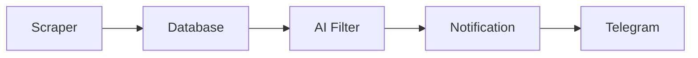

# 🎯 Scout: The Intelligent Tender Hunter

Scout is an automated tender/bid discovery and notification system that leverages AI to find relevant business opportunities across multiple procurement platforms.

## 🌟 Overview

Scout wakes up once every day and performs its magic in under a minute:

1. 🕷️ Scrapes hundreds of tenders from configured websites
2. 🧠 Analyzes each tender using AI
3. ✅ Filters opportunities matching your company's interests
4. 📱 Delivers qualified tenders directly to your Telegram

## 🚀 Key Features

- **Automated Scraping**: Currently supports SomaliJobs and ReliefWeb platforms
- **Intelligent Filtering**: Uses GPT-4 and Claude to analyze tender relevance
- **Real-time Notifications**: Instant Telegram updates with structured tender information
- **Duplicate Prevention**: Smart detection to avoid repeated notifications
- **State Management**: Robust tracking of tender processing status
- **Database Persistence**: SQLite storage for tender history and state

## 🛠️ Technical Architecture

### Framework Stack

- **LangGraph**: Orchestrates the workflow between different components
- **LangChain**: Manages interactions with AI models
- **Pydantic**: Ensures data validation and serialization
- **SQLite**: Provides lightweight but reliable data persistence

### Workflow Components

1. **Scraper Node**

   - Fetches tenders from multiple sources
   - Validates and normalizes data
   - Prevents duplicate entries

2. **Filter Node**

   - Analyzes tenders using AI models
   - Applies company-specific criteria
   - Classifies tenders as qualified/unqualified

3. **Notification Node**
   - Formats tender information
   - Delivers updates via Telegram
   - Tracks notification status

## 💡 Benefits

- **Time Efficiency**: Reduces manual tender searching from hours to seconds
- **Accuracy**: AI-powered analysis ensures relevant matches
- **Never Miss Out**: Automated monitoring catches every opportunity
- **Team Coordination**: Instant team notifications via Telegram
- **Cost Effective**: Minimizes human resources needed for tender discovery
- **Scalable**: Easy to add new sources or modify filtering criteria

## 🏗️ Implementation

Built in just 3 days using:

- **CursorAI**: For rapid development assistance
- **LangGraph**: For workflow orchestration
- **Python**: As the primary programming language
- **AI Models**: GPT-4 and Claude for intelligent analysis

## 🌐 System Flow

1. **Initialization**: System loads configurations and connects to necessary services
2. **Scraping**: Collects tenders from configured sources
3. **Processing**: AI models analyze and filter tenders
4. **Notification**: Qualified tenders are formatted and sent to Telegram
5. **State Management**: System tracks progress and prevents duplicates

## 🎉 Success Story

Scout has transformed the tender discovery process from a time-consuming manual task into an automated, intelligent system. It continuously monitors opportunities 24/7, ensuring your team never misses a relevant tender while saving countless hours of manual searching.

---

_Built with ❤️ using CursorAI and LangGraph_
