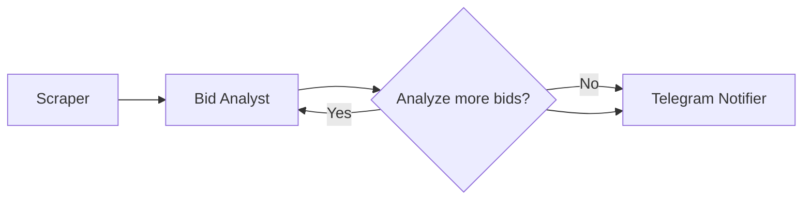

# 🎯 Scout: The Intelligent Bid Hunter

Scout is an automated bid/bid discovery and notification system that leverages AI to find relevant business opportunities across multiple procurement platforms.

## 🌟 Overview

Scout wakes up once every day and performs its magic in under a minute:

1. 🕷️ Scrapes hundreds of bids from configured websites
2. 🧠 Analyzes each bid using AI
3. ✅ Filters opportunities matching your company's interests
4. 📱 Delivers qualified bids directly to your Telegram

## 🚀 Key Features

- **Automated Scraping**: Currently supports SomaliJobs and ReliefWeb platforms
- **Intelligent Filtering**: Uses GPT-4 and Claude to analyze bid relevance
- **Real-time Notifications**: Instant Telegram updates with structured bid information
- **Duplicate Prevention**: Smart detection to avoid repeated notifications
- **State Management**: Robust tracking of bid processing status
- **Database Persistence**: SQLite storage for bid history and state

## 🛠️ Technical Architecture

### Framework Stack

- **LangGraph**: Orchestrates the workflow between different components
- **LangChain**: Manages interactions with AI models
- **Pydantic**: Ensures data validation and serialization
- **SQLite**: Provides lightweight but reliable data persistence

### Workflow Components

1. **Scraper Node**

   - Fetches bids from multiple sources
   - Validates and normalizes data
   - Prevents duplicate entries

2. **Filter Node**

   - Analyzes bids using AI models
   - Applies company-specific criteria
   - Classifies bids as qualified/unqualified

3. **Notification Node**
   - Formats bid information
   - Delivers updates via Telegram
   - Tracks notification status

## 💡 Benefits

- **Time Efficiency**: Reduces manual bid searching from hours to seconds
- **Accuracy**: AI-powered analysis ensures relevant matches
- **Never Miss Out**: Automated monitoring catches every opportunity
- **Team Coordination**: Instant team notifications via Telegram
- **Cost Effective**: Minimizes human resources needed for bid discovery
- **Scalable**: Easy to add new sources or modify filtering criteria

## 🏗️ Implementation

Built in just 3 days using:

- **CursorAI**: For rapid development assistance
- **LangGraph**: For workflow orchestration
- **Python**: As the primary programming language
- **AI Models**: GPT-4 and Claude for intelligent analysis

## 🌐 System Flow



1. **Initialization**: System loads configurations and connects to necessary services
2. **Scraping**: Collects bids from configured sources
3. **Processing**: AI models analyze and filter bids
4. **Notification**: Qualified bids are formatted and sent to Telegram
5. **State Management**: System tracks progress and prevents duplicates

## 🎉 Success Story

Scout has transformed the bid discovery process from a time-consuming manual task into an automated, intelligent system. It continuously monitors opportunities 24/7, ensuring your team never misses a relevant bid while saving countless hours of manual searching.

---

_Built with ❤️ using CursorAI and LangGraph_

## 🐳 Docker Deployment

### Prerequisites

- Docker and Docker Compose installed on your system
- API keys for:
  - OpenAI (GPT-4)
  - Anthropic (Claude)
  - Telegram Bot

### Quick Start

1. **Clone the repository**

   ```bash
   git clone git@github.com:moe1047/scout-the-bid-finder.git
   cd scout-the-bid-finder
   ```

2. **Set up environment variables**

   ```bash
   # Copy the example env file
   cp .env.example .env

   # Edit .env with your API keys
   nano .env
   ```

3. **Build and start the container**
   ```bash
   docker-compose up -d
   ```

### Monitoring & Management

**View Logs**

```bash
# All logs
docker-compose logs -f

# Service logs
docker-compose logs -f scout

# Cron job logs
docker exec scout-agent cat /var/log/scout/cron.log
```

**Manual Trigger**

```bash
# Run the scraper manually
docker-compose exec scout python3 main.py
```

**Container Management**

```bash
# Stop the service
docker-compose down

# Restart the service
docker-compose restart scout

# Check container status
docker-compose ps

# Check container health
docker inspect scout-agent
```

### Configuration

- **Schedule**: Cron job runs every 2 days at midnight UTC
- **Persistence**:
  - Database: `./db/bids.db`
  - Logs: `./logs/`
- **Timezone**: Set to Europe/London (configurable in docker-compose.yml)

### Troubleshooting

1. **Container won't start**

   - Check if all required environment variables are set in `.env`
   - Verify Docker daemon is running
   - Check logs for specific errors

2. **No notifications**

   - Verify Telegram bot token is correct
   - Check if bot has permission to send messages
   - Review cron logs for execution status

3. **Database issues**

   - Ensure `./db` directory has proper permissions
   - Check if volume is properly mounted

4. **Cron not running**
   - Verify timezone settings
   - Check cron logs
   - Ensure cron service is running inside container
